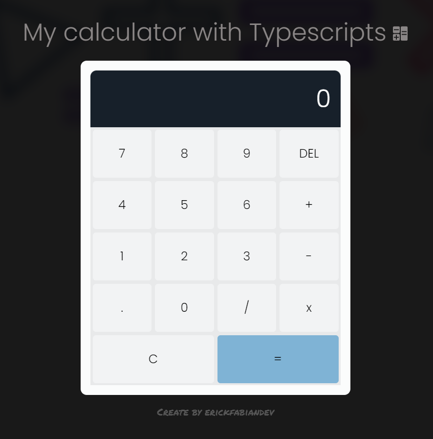
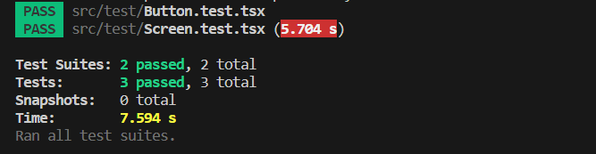

# My calculator with Typescripts 🚀  
## Table of contents :page_facing_up:
- [Overview](#overview)
  - [Installation](#Installation)  
  - [The challenge](#the-challenge)
  - [Screenshot](#screenshot)
- [My process](#my-process)
  - [Built with](#built-with)
  - [What I learned](#what-i-learned)
  - [Continued development](#continued-development)
  - [Unit Tests](#unit-tests)
  - [Useful resources](#useful-resources)
- [Author](#author)

## Overview :writing_hand:
This project is a simple calculator created with TypeScript and React. It allows performing basic mathematical operations such as addition, subtraction, multiplication, and division. The calculator currently supports integers and has plans to implement additional features in future iterations.

### Installation :gear:
To get started with the project, follow these steps:

1. Clone the repository:
```shell
git clone git@github.com:erickfabiandev/calculator.git
  ```
2. Navigate to the project directory:
```shell
cd calculator
 ```
3. Install the dependencies: 
```shell
 npm install
 ```
4. Start the application: 
```shell
 npm run dev
  ```
5. Run Test: to execute the unit tests
```shell
 npm test
  ```

The application will automatically open in your default web browser, ready for exploration.

### The Challenge :weight_lifting_man:
The main goal of this project is to create a functional calculator with the following features:

- Support for basic operations like addition, subtraction, multiplication, and division.
- Intuitive and user-friendly UI.
- Ability to display and calculate multiple sequential operations.
- Support for integers (no decimals).

**Note:** Currently, the calculator only supports integers and performs addition of two numbers at a time. However, as part of continued development, the following improvements are planned:

- Adding support for decimal numbers.
- Implementing the "DEL" function to delete digits individually.
- Incorporating other advanced mathematical functions like trigonometry and square roots.

### Screenshot 📷 
Here is a screenshot of the project's interface:

***desktop view***



***functional view***


***view of the tests***




## My Process :mountain:

### Built With :hammer_and_wrench:
The project was built using the following technologies:

* React
* Sass
* Typescripts
* Jest
* React Testing Library

### What I Learned :microscope:
During this project, I learned how to:

- Create a React application using TypeScript.
- Manage the application state to perform real-time calculations.
- Design and develop an interactive user interface.

### Continued Development :briefcase:
In future iterations of this project, I plan to:

- Enhance the design and appearance of the calculator.
- Implement support for decimal numbers.
- Add the "DEL" function to delete digits individually.
- Extend unit tests to cover new features and edge cases.
- Incorporate other advanced mathematical functions.

### Unit Tests :stethoscope:
This project is a set of unit tests created for the simple calculator developed with TypeScript and React. The tests ensure the accuracy of basic mathematical operations, such as addition, subtraction, multiplication, and division.

During this project, I learned how to:

- Write effective unit tests for React components.
- Use Jest as the testing framework and React Testing Library to facilitate testing of React components.


### Useful Resources :sos:
During the development of this project, the following resources were helpful:

* Official React documentation: https://reactjs.org/docs
* Official Sass documentation: https://sass-lang.com/documentation
* TypeScript Documentation: https://www.typescriptlang.org/docs/
* React Icons: https://react-icons.github.io/react-icons/
* Jest Documentation: https://jestjs.io/docs/getting-started
* React Testing Library Documentation: https://testing-library.com/docs/

## Author :nerd_face:

This project created by erickfabiandev.
- [erickfabiandev](https://www.erickfabiandev.com/)
